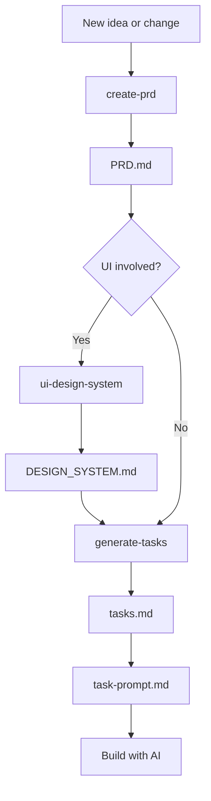

# A More Consistent Way to Build with AI

Building a website with a coding agent is great, until the project gets bigger.

You ask for one change, and somehow something else changes with it.

Or you already agreed on how something should work, but a few changes later, the agent does it a different way again. Styles start drifting, old decisions get ignored, and eventually you spend more time fixing and redoing things than actually building new ones.

That is the part I wanted to fix. I hate it when things stop being consistent, or when AI keeps changing things that were already decided or already working.

So I made these three Skills to help keep the product logic, UI, and implementation consistent as the project grows.

## `create-prd`

When you're building with AI, the code doesn't always tell you what the product is supposed to be like. And you probably don't want the AI to scan the whole codebase every time.

That's where a PRD helps. It gives the AI the product context, and it also helps us keep track of those decisions ourselves.

`create-prd` keeps that context and those decisions in one place. It documents the current scope, existing features, pages, user flows, business rules, interactions, important copy, error states, and any relevant data, auth, payment, or external-service requirements.

Then when a new change starts, the AI has something concrete to work from instead of guessing from the code or the latest chat.

## `ui-design-system`

UI inconsistency drives me crazy.

I'm not a designer. I can tell when something looks wrong, but I don't always know how to make it look better.

For me, good UI mostly means keeping things neat and consistent, and making the same things look and behave the same way.

So I made `ui-design-system`.

It keeps the recurring UI and interaction rules in one place. When I'm working on a task, or something starts to look off, I can ask the AI to follow the Design System instead of explaining the same things again and again: this spacing is too wide, that button should have the same rounded corners as the others, this mobile layout should work like the rest.

The point is not to make everything fancy. I mostly want the UI to stay neat and feel like it belongs to the same product.

## `generate-tasks`

Once we know what to build and what it should look like, the next problem is actually building it.

A good PRD helps, but it does not guarantee the implementation will come out the way you expected. A task can still be too big, done in the wrong order, touch the wrong files, miss a dependency, or look finished without actually being verified.

So I use a proper task document before coding starts.

`generate-tasks` does more than split the PRD into a to-do list. It checks the actual repository, works out dependencies and conflicts, keeps each task small enough to verify, lists the files likely to be involved, and makes verification part of the task instead of something we remember at the end.

It also catches things the AI cannot do by itself — like a login, approval, secret, or real-service setup — so those do not suddenly block the work halfway through.

Then it creates `task-prompt.md`, which is the version I actually use day to day.

It works more like a to-do list: I can see what is already done, what is still open, what depends on something else, and where tasks may conflict.

When I am ready to continue, I can just copy the next prompt and give it to the AI.

So most of the time, I only need this file. `tasks.md` keeps the full implementation plan in the background.

## How I Use Them Together

For most changes, I start with the PRD.

If the change involves UI, I check the Design System before creating the tasks. That way the UI rules are already clear before the implementation plan is written.

If there is no UI work, I can skip that step and go straight from the PRD to the tasks.

Then I use `task-prompt.md` to actually work through the tasks with AI.



It is not a strict process where every Skill has to run every time.

The PRD is the product source of truth. The Design System is there when the work touches UI. `tasks.md` holds the full implementation plan, and `task-prompt.md` is the shorter list I actually use while building.

If a new UI pattern turns out to be worth reusing, I can update the Design System again later. I do not use it as a last-minute "make everything pretty" pass.

## Installation

<details>
<summary><strong>👉 Show installation steps</strong></summary>

### 1. Download the repository

Click the green **Code** button at the top of this page, then choose **Download ZIP**.

Unzip the downloaded file. You only need this folder to install the Skills, so you can delete it later.

### 2. Install the Skills

The downloaded folder contains three Skills:

```text
create-prd
generate-tasks
ui-design-system
```

Open Terminal and go into the unzipped `ai-product-workflow` folder first.

For example:

```bash
cd ~/Downloads/ai-product-workflow-main
```

#### Option A — Use the shared personal Skills folder

If your coding agent supports the shared personal Skills folder, this is the simplest option.

Run:

```bash
mkdir -p ~/.agents/skills

cp -R create-prd ~/.agents/skills/
cp -R generate-tasks ~/.agents/skills/
cp -R ui-design-system ~/.agents/skills/
```

You should now have:

```text
~/.agents/skills/
├── create-prd/
├── generate-tasks/
└── ui-design-system/
```

#### Option B — Use your agent's own Skills folder

If your coding agent uses its own Skills folder, change the destination path.

**Gemini CLI**

```bash
mkdir -p ~/.gemini/skills

cp -R create-prd ~/.gemini/skills/
cp -R generate-tasks ~/.gemini/skills/
cp -R ui-design-system ~/.gemini/skills/
```

**Claude Code**

```bash
mkdir -p ~/.claude/skills

cp -R create-prd ~/.claude/skills/
cp -R generate-tasks ~/.claude/skills/
cp -R ui-design-system ~/.claude/skills/
```

If you use several coding agents, I prefer keeping one shared copy where possible instead of maintaining multiple copies of the same Skills.

If you are not sure which folder your agents use, ask the AI to check first.

Give it this prompt:

```text
I downloaded and unzipped ai-product-workflow here:

<PATH_TO_AI_PRODUCT_WORKFLOW>

It contains three Skills:
- create-prd
- generate-tasks
- ui-design-system

Please inspect my current coding-agent setup and find the supported personal Skills directory for each coding agent I have installed.

I would prefer to keep one shared copy under ~/.agents/skills where possible instead of maintaining duplicate copies.

If an agent supports ~/.agents/skills, install the three Skills there.

If an agent requires its own Skills directory, use its supported directory instead.

Before changing anything, tell me:
1. which coding agents you found,
2. which Skills directory each one uses,
3. exactly what you plan to install or link.

Then install them.

Do not modify the Skill files themselves.
```

### 3. Check that the Skills work

Restart or reopen your coding agent if needed, then check whether it can see the Skills.

**Codex**

```text
$create-prd
```

**Gemini CLI**

```text
/skills list
```

**Claude Code**

```text
/create-prd
```

If the Skill appears or starts correctly, the installation is done.

### 4. Delete the downloaded folder

Once the Skills are installed and working, you no longer need the downloaded `ai-product-workflow` folder.

You can simply delete it. The copies inside your Skills folder will stay there.

</details>

## What Gets Added to the Project

These Skills do not need a special code structure.

They mainly work with a few files under `docs/project/`:

```text
docs/
└── project/
    ├── PRD.md
    ├── design/
    │   └── DESIGN_SYSTEM.md
    ├── tasks.md
    └── task-prompt.md
```

- `PRD.md` keeps the product scope, behavior, rules, and decisions.
- `DESIGN_SYSTEM.md` keeps the recurring UI and interaction rules.
- `tasks.md` keeps the full implementation plan.
- `task-prompt.md` is the working to-do/done list I use with AI.

Your project can have any other docs or code structure around these. The Skills do not require a specific framework, folder structure, or tech stack.

## Quick Start

Once the Skills are available to your AI coding tool, I usually use them like this.

Use your tool's normal Skill invocation syntax.

### Start or update the PRD

**Skill:** `create-prd`

```text
I want to add...
Please check the current project and update the PRD first.
```

### Check the UI rules when the change involves UI

**Skill:** `ui-design-system`

```text
Check this change against the current Design System and update it if needed.
```

If the project does not have a Design System yet, the Skill can initialize one from the current UI patterns and shared components.

### Create the implementation plan

**Skill:** `generate-tasks`

```text
Create the tasks from the current PRD.
```

After that, I normally work from `task-prompt.md` and copy the next prompt when I am ready to continue.

## Example

Say I want to add a user credit balance with automatic recharge when the balance gets low.

### 1. Start with `create-prd`

I can give the Skill a rough request:

```text
Add a user credit balance with automatic recharge when the balance drops below a threshold.
```

The PRD turns that into something much more concrete: what is in scope, how the user opts in, when recharge happens, what the user sees, what happens when payment fails, and what should not change.

<details>
<summary><strong>👉 See a small PRD example</strong></summary>

```markdown
# Credit Balance & Auto-Recharge Product Requirements Document (PRD)

- Status: Confirmed
- Document language: en

## 3. Project Type & Scope

### Current Scope

- `FR-001` — Show the user's current credit balance.
- `FR-002` — Let the user opt in to automatic recharge and choose a threshold.
- `FR-003` — Recharge through the existing payment provider when the balance drops below the confirmed threshold.

### Existing Baseline

- `PAGE-001` — Keep the current billing page and existing payment method flow.

### Possible Later

- Multiple recharge packs.
- Balance alerts by email.

## 6. Interaction Flows

### `FLOW-001` — Enable automatic recharge

1. The user opens billing settings.
2. The user enables automatic recharge and chooses a threshold.
3. The system shows the recharge amount and payment method before saving.
4. On success, the setting is saved and shown as active.
5. On failure, the setting is not enabled and the user sees what needs attention.

## 7. Functional Requirements

### `FR-002` — Enable automatic recharge

- Trigger: the user enables auto-recharge in billing settings.
- System behavior: save the confirmed threshold and recharge preference.
- User-visible result: the billing page shows auto-recharge as active and displays the threshold.
- Boundaries: do not change the user's payment method without explicit action.
- Acceptance criteria: after saving, the setting persists and is shown correctly when the user returns.
```

</details>

### 2. Check the UI with `ui-design-system`

Because this feature has UI, I check the Design System before creating the tasks.

The goal is not to redesign billing. It is to make the new balance and auto-recharge controls fit the product that already exists.

```text
Check the credit balance and auto-recharge UI against the current Design System and update the Design System only if a reusable rule is missing.
```

<details>
<summary><strong>👉 See a small Design System example</strong></summary>

```markdown
## 5. Component Patterns

### 5.1 Buttons & actions

- Billing settings use the existing primary and secondary button hierarchy.
- Destructive payment actions must not share the primary-action styling.

### 5.3 Cards, rows & item boundaries

- Balance status and recharge settings use the existing settings-row pattern.
- Do not introduce a second card style just for billing.

### 5.9 Status, feedback & notifications

- Normal balance state uses the standard informational treatment.
- Low balance uses the existing warning treatment.
- Payment failure uses the existing destructive/error treatment.

## 6. Interaction Rules

- Auto-recharge stays off until the user explicitly confirms it.
- Success and failure feedback stay inside the existing billing feedback pattern.
```

</details>

### 3. Create the implementation plan with `generate-tasks`

Now the product rules and relevant UI rules are clear, so I generate the implementation plan.

```text
Create the tasks from the current PRD.
```

`tasks.md` keeps the full plan: requirement traceability, dependencies, blockers, files, task boundaries, user prerequisites, and verification.

<details>
<summary><strong>👉 See a small tasks.md example</strong></summary>

```markdown
# Implementation Tasks

## Task Packages

### [x] 1.0 Add credit balance and recharge preference data

- Task Type: `Formal Task Package`
- Status: `✅ Approved`
- Acceptance: `AI verification`
- Source: `FR-001`, `FR-002`
- Dependencies: `None`
- Files:
  - `src/.../billing-data`
- AI Verification: `T-001`

### [ ] 2.0 Connect automatic recharge to the payment flow

- Task Type: `Formal Task Package`
- Status: `⬜ Pending`
- Acceptance: `AI verification`
- Human Prerequisite: `Required`
- Prerequisite Status: `Pending`
- Real Integration: `Pending`
- Source: `FR-003`
- Dependencies: `1.0`
- Files:
  - `src/.../billing-service`
  - `src/.../payment-webhook`
- AI Verification: `T-002`

### [ ] 3.0 Add balance and auto-recharge settings UI

- Task Type: `Formal Task Package`
- Status: `⬜ Pending`
- Acceptance: `AI verification then human review`
- Source: `FR-001`, `FR-002`
- Dependencies: `1.0`
- Files:
  - `src/.../billing-settings`
- AI Verification: `T-003`
```

</details>

### 4. Work from `task-prompt.md`

This is the file I would actually keep open while doing the work.

It shows what is already done, what is still open, dependencies and conflicts, and gives me a prompt I can copy straight to the AI.

<details>
<summary><strong>👉 See a small task-prompt.md example</strong></summary>

````markdown
# Credit Balance & Auto-Recharge — Task Execution Prompts

## Completed

1.0

## Unfinished

❗2.0, 3.0

## Task 2.0 — Connect automatic recharge to the payment flow

- Dependencies: 1.0
- Conflicts: 3.0

- Now: The project can store the balance and recharge settings, but it cannot recharge through the real payment flow yet.
- This task: The AI will connect the recharge service and payment result handling.
- After: A verified payment can update the user's credit balance through the real integration path.

**Prompt for coding agent**

```text
Execute Task 2.0 in docs/project/tasks.md. Read the complete parent task and inspect the current implementation first. Implement and verify only that task. When finished, update docs/project/tasks.md and docs/project/task-prompt.md, then create a commit whose subject starts with 2.0.
```

## Task 3.0 — Add balance and auto-recharge settings UI

- Dependencies: 1.0
- Conflicts: 2.0

- Now: Users cannot see their balance or manage auto-recharge from billing settings.
- This task: The AI will add the balance and auto-recharge UI using the existing Design System rules.
- After: Users can see their balance and manage auto-recharge without introducing a different billing UI pattern.

**Prompt for coding agent**

```text
Execute Task 3.0 in docs/project/tasks.md. Read the complete parent task and inspect the current implementation first. Implement and verify only that task. When finished, update docs/project/tasks.md and docs/project/task-prompt.md, then create a commit whose subject starts with 3.0.
```
````

</details>

Most of the detail stays in the documents. Day to day, I can just look at `task-prompt.md`, pick the next runnable task, copy the prompt, and continue.

## What's Inside This Repo

Each top-level directory is one Skill:

```text
.
├── create-prd/
│   ├── SKILL.md
│   ├── agents/
│   ├── assets/
│   ├── locales/
│   ├── references/
│   └── scripts/
├── generate-tasks/
│   ├── SKILL.md
│   ├── agents/
│   ├── assets/
│   ├── locales/
│   ├── references/
│   ├── scripts/
│   └── tests/
├── ui-design-system/
│   ├── SKILL.md
│   ├── agents/
│   ├── assets/
│   ├── locales/
│   ├── references/
│   └── scripts/
├── AGENTS.md
├── LICENSE
└── README.md
```

`SKILL.md` contains the main workflow. The other folders hold templates, detailed rules, locale mappings, validators, tests, and agent metadata where needed.

## License

Copyright 2026 Katrina Lin.

Licensed under the [Apache License 2.0](./LICENSE).

You may use, modify, and distribute these Skills, including for commercial use, subject to the terms of the license.
