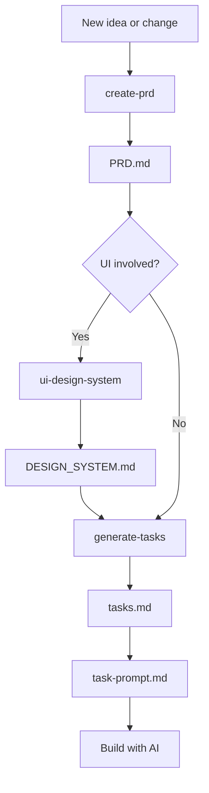

# A More Consistent Way to Build with AI

Building a website with a coding agent is great, until the project gets bigger.

You ask for one change, and somehow something else changes with it.

Or you already agreed on how something should work, but a few changes later, the agent does it a different way again. Styles start drifting, old decisions get ignored, and eventually you spend more time fixing and redoing things than actually building new ones.

That is the part I wanted to fix. I hate it when things stop being consistent, or when AI keeps changing things that were already decided or already working.

So I made these three Skills to help keep the product logic, UI, and implementation consistent as the project grows.

## `create-prd`

When you're building with AI, the code doesn't always tell you what the product is supposed to be like. And you probably don't want the AI to scan the whole codebase every time.

That's where a PRD helps. It gives the AI the product context, and it also helps us keep track of those decisions ourselves.

`create-prd` keeps that context and those decisions in one place. It documents the current scope, existing features, pages, user flows, business rules, interactions, important copy, error states, and any relevant data, auth, payment, or external-service requirements.

Then when a new change starts, the AI has something concrete to work from instead of guessing from the code or the latest chat.

## `ui-design-system`

UI inconsistency drives me crazy.

I'm not a designer. I can tell when something looks wrong, but I don't always know how to make it look better.

For me, good UI mostly means keeping things neat and consistent, and making the same things look and behave the same way.

So I made `ui-design-system`.

It keeps the recurring UI and interaction rules in one place. When I'm working on a task, or something starts to look off, I can ask the AI to follow the Design System instead of explaining the same things again and again: this spacing is too wide, that button should have the same rounded corners as the others, this mobile layout should work like the rest.

The point is not to make everything fancy. I mostly want the UI to stay neat and feel like it belongs to the same product.

## `generate-tasks`

Once we know what to build and what it should look like, the next problem is actually building it.

A good PRD helps, but it does not guarantee the implementation will come out the way you expected. A task can still be too big, done in the wrong order, touch the wrong files, miss a dependency, or look finished without actually being verified.

So I use a proper task document before coding starts.

`generate-tasks` does more than split the PRD into a to-do list. It checks the actual repository, works out dependencies and conflicts, keeps each task small enough to verify, lists the files likely to be involved, and makes verification part of the task instead of something we remember at the end.

It also catches things the AI cannot do by itself — like a login, approval, secret, or real-service setup — so those do not suddenly block the work halfway through.

Then it creates `task-prompt.md`, which is the version I actually use day to day.

It works more like a to-do list: I can see what is already done, what is still open, what depends on something else, and where tasks may conflict.

When I am ready to continue, I can just copy the next prompt and give it to the AI.

So most of the time, I only need this file. `tasks.md` keeps the full implementation plan in the background.

## How I Use Them Together

For most changes, I start with the PRD.

If the change involves UI, I check the Design System before creating the tasks. That way the UI rules are already clear before the implementation plan is written.

If there is no UI work, I can skip that step and go straight from the PRD to the tasks.

Then I use `task-prompt.md` to actually work through the tasks with AI.



It is not a strict process where every Skill has to run every time.

The PRD is the product source of truth. The Design System is there when the work touches UI. `tasks.md` holds the full implementation plan, and `task-prompt.md` is the shorter list I actually use while building.

If a new UI pattern turns out to be worth reusing, I can update the Design System again later. I do not use it as a last-minute "make everything pretty" pass.

## What Gets Added to the Project

These Skills do not need a special code structure.

They mainly work with a few files under `docs/project/`:

```text
docs/
└── project/
    ├── PRD.md
    ├── design/
    │   └── DESIGN_SYSTEM.md
    ├── tasks.md
    └── task-prompt.md
```

- `PRD.md` keeps the product scope, behavior, rules, and decisions.
- `DESIGN_SYSTEM.md` keeps the recurring UI and interaction rules.
- `tasks.md` keeps the full implementation plan.
- `task-prompt.md` is the working to-do/done list I use with AI.

Your project can have any other docs or code structure around these. The Skills do not require a specific framework, folder structure, or tech stack.

## Quick Start

Once the Skills are available to your AI coding tool, I usually use them like this.

Use your tool's normal Skill invocation syntax.

### Start or update the PRD

**Skill:** `create-prd`

```text
I want to add...
Please check the current project and update the PRD first.
```

### Check the UI rules when the change involves UI

**Skill:** `ui-design-system`

```text
Check this change against the current Design System and update it if needed.
```

If the project does not have a Design System yet, the Skill can initialize one from the current UI patterns and shared components.

### Create the implementation plan

**Skill:** `generate-tasks`

```text
Create the tasks from the current PRD.
```

After that, I normally work from `task-prompt.md` and copy the next prompt when I am ready to continue.

## A Short Example

Say I want to add a user credit balance with automatic recharge.

I would use the Skills like this:

1. `create-prd` defines how the balance, threshold, opt-in, payment rules, error states, and scope should work.
2. Because the feature has UI, `ui-design-system` checks the balance indicator and settings UI against the project's existing patterns.
3. `generate-tasks` turns the approved PRD, repository facts, and relevant UI rules into implementation tasks with dependencies, conflicts, files, and verification.
4. `task-prompt.md` becomes the working list I use to see what is done and copy the next prompt.

The exact implementation can change from project to project. The point is that the product decisions, UI rules, and execution plan are not all being reinvented in the same chat.

## Installation

For the full workflow, install all three Skills and use the ones you need for each change.

<details>
<summary><strong>👉 Show installation steps</strong></summary>

### Choose where to download the repository

The repository can be downloaded anywhere on your computer. This is only the source folder you copy the Skills from — it is not the final Skills location.

For example:

```bash
cd ~/Downloads
git clone https://github.com/kat-builds/ai-product-workflow.git
cd ai-product-workflow
```

You can replace `~/Downloads` with any folder you prefer.

### Install all three Skills

#### Codex or Gemini CLI

Create the shared personal Skills folder if it does not already exist:

```bash
mkdir -p ~/.agents/skills
```

Copy all three Skills:

```bash
cp -R create-prd ~/.agents/skills/
cp -R generate-tasks ~/.agents/skills/
cp -R ui-design-system ~/.agents/skills/
```

#### Claude Code

Claude Code uses its own personal Skills folder:

```bash
mkdir -p ~/.claude/skills

cp -R create-prd ~/.claude/skills/
cp -R generate-tasks ~/.claude/skills/
cp -R ui-design-system ~/.claude/skills/
```

### Install for one project only

Use this when you want the Skills available only inside one repository instead of across all projects on your computer.

- **Codex / Gemini CLI:** copy the Skill folders into `.agents/skills/` inside the target project.
- **Claude Code:** copy the Skill folders into `.claude/skills/` inside the target project.

### Install an individual Skill

The Skills can also be used separately when the required input already exists:

- **`create-prd`** can be used on its own to create or maintain a PRD.
- **`ui-design-system`** can be used on its own to initialize, update, preflight, or audit UI rules.
- **`generate-tasks`** can be used on its own when the project already has a validated `docs/project/PRD.md`.

### Skill locations and invocation

| Agent | Personal Skills folder | Project Skills folder | Example invocation |
| --- | --- | --- | --- |
| **Codex** | `~/.agents/skills/` | `.agents/skills/` | `$create-prd` |
| **Gemini CLI** | `~/.agents/skills/` or `~/.gemini/skills/` | `.agents/skills/` or `.gemini/skills/` | Use `/skills list` to confirm discovery |
| **Claude Code** | `~/.claude/skills/` | `.claude/skills/` | `/create-prd` |

For current host-specific behavior, see the official documentation for [OpenAI Skills](https://developers.openai.com/codex/skills), [Gemini CLI Agent Skills](https://github.com/google-gemini/gemini-cli/blob/main/docs/cli/skills.md), and [Claude Code Skills](https://code.claude.com/docs/en/skills).

</details>

## What's Inside This Repo

Each top-level directory is one Skill:

```text
.
├── create-prd/
│   ├── SKILL.md
│   ├── agents/
│   ├── assets/
│   ├── locales/
│   ├── references/
│   └── scripts/
├── generate-tasks/
│   ├── SKILL.md
│   ├── agents/
│   ├── assets/
│   ├── locales/
│   ├── references/
│   ├── scripts/
│   └── tests/
├── ui-design-system/
│   ├── SKILL.md
│   ├── agents/
│   ├── assets/
│   ├── locales/
│   ├── references/
│   └── scripts/
├── AGENTS.md
├── LICENSE
└── README.md
```

`SKILL.md` contains the main workflow. The other folders hold templates, detailed rules, locale mappings, validators, tests, and agent metadata where needed.

## License

Copyright 2026 Katrina Lin.

Licensed under the [Apache License 2.0](./LICENSE).

You may use, modify, and distribute these Skills, including for commercial use, subject to the terms of the license.
