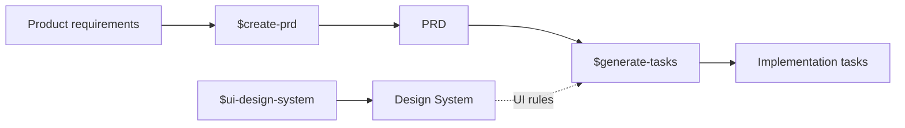

# AI Product Workflow Skills

Three reusable Skills for turning product requirements into a clear PRD, implementation tasks, and UI rules that AI can follow consistently.

I built these Skills to make AI-assisted product work more structured and repeatable. Each Skill has one job, its own supporting rules and templates, and validation where it is useful.

> **Agent compatibility:** these Skills use the open `SKILL.md` Agent Skills format. This workflow is developed around Codex, but the Skill structure is also supported by Gemini CLI and Claude Code. Installation paths and invocation syntax differ by tool. The generated `task-prompt.md` currently uses Codex as the execution agent.

## At a Glance

| Skill | What it does | Output |
| --- | --- | --- |
| [`$create-prd`](./create-prd) | Define what to build before implementation starts | `docs/project/PRD.md` |
| [`$generate-tasks`](./generate-tasks) | Turn an approved PRD into traceable tasks, dependencies, verification steps, and copy-ready execution prompts | `docs/project/tasks.md` + `docs/project/task-prompt.md` |
| [`$ui-design-system`](./ui-design-system) | Capture project-specific UI rules so future AI changes can reuse existing patterns consistently | `docs/project/design/DESIGN_SYSTEM.md` |

Each Skill keeps a different responsibility clear:

- **PRD** owns product scope and behavior.
- **Design System** owns recurring UI and interaction rules.
- **Tasks** turn approved requirements into executable implementation work.

## How the Skills Work Together

`$create-prd` and `$generate-tasks` work as a sequence: define the product first, then turn the approved PRD into implementation tasks.

`$ui-design-system` is separate. It captures the project's recurring UI rules so future AI changes can reuse existing patterns instead of redesigning each screen. It can be used before UI work, during planning, or later to check for design drift.



## Quick Start

Already installed? Invoke the Skill you need from the project you are working on.

### Create or update product requirements

**Codex**

```text
$create-prd Create or update the PRD from the requirements and current repository.
```

### Create or review UI rules

**Codex**

```text
$ui-design-system Initialize the project's Design System from its current UI patterns and shared components.
```

### Generate implementation tasks

**Codex**

```text
$generate-tasks Generate implementation tasks from the current PRD.
```

Using another Agent Skills-compatible tool? See [Installation](#installation) for the correct Skill location and invocation style.

## Worked Example

The example below shows how the three Skills can work together on one feature.

**Scenario:** add a user credit balance with automatic Stripe recharge when the balance drops below a chosen threshold.

For this example, the Design System Skill is used before task generation because the feature includes new UI. It can also be used independently in other workflows.

### Step 1 — Define the product with `$create-prd`

```text
$create-prd Add user credit balance with automatic Stripe recharge when balance drops below threshold.
```

**What this Skill does here**

It checks the current repository, resolves important product decisions, keeps non-goals explicit, and writes the approved scope to `docs/project/PRD.md` with stable requirement IDs.

**What you get**

- clear goals and non-goals
- stable `FR-*` and `NFR-*` requirement IDs
- explicit product decisions
- a validated PRD ready for planning

#### 📄 Example PRD output

<details>
<summary><strong>▶ Open generated PRD</strong></summary>

```markdown
# Product Requirements Document: Credit Balance & Auto-Recharge

## Status & Boundaries

- Status: VALIDATED
- Target Path: `docs/project/PRD.md`

## Problem & Goals

- Provide users with uninterrupted access by auto-topping up credits when low.
- Prevent unapproved recurring charges by requiring explicit user opt-in.

## Non-Goals

- Manual bank transfer or invoice payments.
- Real-time balance streaming over WebSocket (dashboard polling is sufficient).

## Functional Requirements

- **FR-01 (Balance Display):** User dashboard shows remaining credits and current recharge threshold.
- **FR-02 (Opt-in Auto-Recharge):** User can enable auto-recharge, choosing threshold (default: 10 credits) and pack size (default: 100 credits for $10).
- **FR-03 (Payment Webhook Trigger):** When balance drops below threshold during an API call, trigger background recharge via Stripe off-session payment.

## Non-Functional Requirements

- **NFR-01 (Idempotency):** Stripe payment intents must pass idempotent request keys derived from user ID and billing epoch.
```

</details>

### Step 2 — Capture UI rules with `$ui-design-system`

```text
$ui-design-system Update the Design System for the credit status badge and auto-recharge settings.
```

**What this Skill does here**

It uses the approved product requirements as context, then updates the project's reusable UI rules without redefining product behavior.

**What you get**

- reusable visual and interaction rules
- shared component patterns
- responsive behavior
- a project-level reference future AI changes can follow

#### 🎨 Example Design System output

<details>
<summary><strong>▶ Open generated Design System</strong></summary>

```markdown
# UI Design System: Billing & Balance Primitives

## Semantic Color Tokens

- `--status-credit-normal`: `hsl(var(--primary))`
- `--status-credit-warning`: `hsl(38 92% 50%)` (Active when balance < threshold)
- `--status-credit-empty`: `hsl(0 84% 60%)` (Active when balance == 0)

## Canonical Component Patterns

### Credit Status Indicator

- Role: Compact dashboard badge displaying current balance and health status.
- Warning State: Uses `--status-credit-warning` background with alert icon; tooltip displays auto-recharge status.
- Class convention: `inline-flex items-center gap-1.5 px-2.5 py-1 rounded-full text-xs font-medium`

### Auto-Recharge Settings Modal

- Role: Financial authorization dialog.
- Rules: Requires explicit checkbox confirmation before enabling; primary CTA must clearly state charge amount (for example, "Save & Authorize $10.00").
- Responsive: Bottom sheet on mobile (< 640px); centered modal with backdrop blur on desktop.
```

</details>

### Step 3 — Plan and execute with `$generate-tasks`

```text
$generate-tasks Generate implementation tasks for Credit Balance & Auto-Recharge from the validated PRD.
```

**What this Skill does here**

It uses the approved PRD as the source of scope, checks the Design System for relevant UI constraints, and breaks the feature into traceable tasks with dependencies and verification.

It produces two files with different jobs:

- **`tasks.md`** — the complete task plan and source of truth.
- **`task-prompt.md`** — the simpler execution view: what is done, what is next, and the exact prompt to copy to Codex.

#### Task status

`tasks.md` tracks each parent task through:

```text
⬜ Pending → 🔵 In progress → 🟡 Ready for review → ✅ Approved

⛔ Blocked
```

`task-prompt.md` keeps completed task IDs visible, shows unfinished work in recommended execution order, and marks the current critical-path task with `❗`.

#### ✅ Example task plan

<details>
<summary><strong>▶ Open generated tasks.md</strong></summary>

```markdown
# Implementation Tasks: Credit Balance & Auto-Recharge

## Dependency Graph & Execution Order

- Task 1.0 (Database schema for balance & recharge preferences) [Root]
  ├── Task 2.0 (Stripe off-session recharge service & webhook handler) [Depends on: 1.0]
  └── Task 3.0 (Frontend balance badge & recharge settings modal) [Depends on: 1.0]
      └── Task 4.0 (End-to-end billing integration test) [Depends on: 2.0, 3.0]

## Task Packages

### [x] 1.0 Add credit balance schema and recharge preferences

- **Status:** `✅ Approved`
- **Source:** `FR-01`, `FR-02`
- **AI Verification:** schema checks and focused database tests passed

### [ ] 2.0 Connect Stripe recharge and webhook handling

- **Status:** `⬜ Pending`
- **Source:** `FR-02`, `FR-03`
- **Depends on:** `1.0`
- **Real integration:** Pending
- **AI Verification:** Stripe test-mode flow + webhook verification

### [ ] 3.0 Add balance and auto-recharge UI

- **Status:** `⬜ Pending`
- **Source:** `FR-01`, `FR-02`
- **Depends on:** `1.0`
- **Design System constraint:** reuse the approved balance indicator and recharge settings patterns
- **AI Verification:** typecheck + focused UI state verification
```

</details>

#### 📋 Example execution prompts

At this point, `task-prompt.md` gives the user a much smaller working view:

```text
Completed
1.0

Remaining
❗2.0, 3.0
```

The `❗` marks the current critical-path task.

<details>
<summary><strong>▶ Open generated task-prompt.md</strong></summary>

```markdown
# Credit Balance & Auto-Recharge — Task Execution Prompts

## Completed

1.0

## Remaining

❗2.0, 3.0

## Task 2.0 — Connect Stripe recharge and webhook handling

- Depends on: 1.0
- Conflicts with: 3.0

- Now: The project can store credit balances and recharge settings, but it cannot charge or update a balance through Stripe yet.
- This task: Codex will connect the recharge service and webhook flow using Stripe test mode.
- After: A successful test payment can update the user's balance through the real integration path.

**Prompt to send to Codex**

```text
Execute Task 2.0 from docs/project/tasks.md. Read the complete task first and inspect the current implementation. Complete the implementation and verification exactly within the task scope. When finished, update docs/project/tasks.md and docs/project/task-prompt.md, then create a commit beginning with 2.0.
```

## Task 3.0 — Add balance and auto-recharge UI

- Depends on: 1.0
- Conflicts with: 2.0

- Now: Users cannot see their balance or manage auto-recharge.
- This task: Codex will add the balance status and recharge settings UI using the project Design System.
- After: Users can see their current balance and configure auto-recharge from the dashboard.

**Prompt to send to Codex**

```text
Execute Task 3.0 from docs/project/tasks.md. Read the complete task first and inspect the current implementation. Complete the implementation and verification exactly within the task scope. When finished, update docs/project/tasks.md and docs/project/task-prompt.md, then create a commit beginning with 3.0.
```
```

</details>

## Design Principles

- Define product scope before planning implementation.
- Keep current work separate from existing behavior and future ideas.
- Trace implementation tasks back to PRD requirements.
- Check the current repository instead of guessing how the project works.
- Plan verification before implementation starts.
- Do not add infrastructure or product scope just because a project template supports it.
- Keep product behavior in the PRD and recurring UI rules in the Design System.

## Repository Structure

```text
.
├── create-prd/
│   ├── SKILL.md
│   ├── agents/
│   ├── assets/
│   ├── references/
│   └── scripts/
├── generate-tasks/
│   ├── SKILL.md
│   ├── agents/
│   ├── assets/
│   ├── references/
│   ├── scripts/
│   └── tests/
├── ui-design-system/
│   ├── SKILL.md
│   ├── agents/
│   ├── assets/
│   ├── references/
│   └── scripts/
├── AGENTS.md
├── LICENSE
└── README.md
```

Each Skill uses the same basic structure. `SKILL.md` contains the main workflow, with supporting templates, references, validators, tests, and agent metadata where needed.

## Installation

You can install all three Skills or only the ones you want.

### Which folder does my agent use?

| Agent | Personal Skills folder | Project Skills folder | Direct invocation |
| --- | --- | --- | --- |
| **Codex** | `~/.agents/skills/` | `.agents/skills/` | `$create-prd` |
| **Gemini CLI** | `~/.agents/skills/` or `~/.gemini/skills/` | `.agents/skills/` or `.gemini/skills/` | Gemini can activate a matching Skill; use `/skills list` to confirm discovery |
| **Claude Code** | `~/.claude/skills/` | `.claude/skills/` | `/create-prd` |

The steps below use a **personal installation**, which makes the Skills available across your projects on that computer.

### 1. Download this repository

Open Terminal and run:

```bash
git clone https://github.com/kat-builds/ai-product-workflow.git
```

This downloads a folder named `ai-product-workflow` to your current location.

### 2. Open the downloaded folder in Terminal

```bash
cd ai-product-workflow
```

The next commands are run from inside this folder.

### 3. Install for Codex or Gemini CLI

Create the shared personal Skills folder if it does not already exist:

```bash
mkdir -p ~/.agents/skills
```

Copy all three Skill folders into it:

```bash
cp -R create-prd ~/.agents/skills/
cp -R generate-tasks ~/.agents/skills/
cp -R ui-design-system ~/.agents/skills/
```

What these commands do:

- `mkdir -p` creates the Skills folder only if it is missing.
- `cp -R` copies the complete Skill folder, including `SKILL.md`, references, templates, scripts, and tests.

For **Codex**, you can then invoke the Skills with `$create-prd`, `$generate-tasks`, and `$ui-design-system`.

For **Gemini CLI**, run:

```text
/skills list
```

to confirm that Gemini discovered them.

### 4. Install for Claude Code instead

If you use Claude Code, copy the same Skills into Claude's personal Skills folder:

```bash
mkdir -p ~/.claude/skills

cp -R create-prd ~/.claude/skills/
cp -R generate-tasks ~/.claude/skills/
cp -R ui-design-system ~/.claude/skills/
```

Then invoke them with:

```text
/create-prd
/generate-tasks
/ui-design-system
```

### 5. Install only one Skill

You do not need all three.

For example, to install only the Design System Skill for Codex or Gemini CLI:

```bash
mkdir -p ~/.agents/skills
cp -R ui-design-system ~/.agents/skills/
```

For Claude Code:

```bash
mkdir -p ~/.claude/skills
cp -R ui-design-system ~/.claude/skills/
```

<details>
<summary><strong>▶ Install Skills for one project only</strong></summary>

Use this when you want the Skills available only inside one repository rather than across all of your projects.

For Codex or Gemini CLI, copy the Skill folders into your target project's `.agents/skills/` directory.

For Claude Code, copy them into the target project's `.claude/skills/` directory.

</details>

For current host-specific behavior, see the official documentation for [OpenAI Skills](https://developers.openai.com/codex/skills), [Gemini CLI Agent Skills](https://github.com/google-gemini/gemini-cli/blob/main/docs/cli/skills.md), and [Claude Code Skills](https://code.claude.com/docs/en/skills).

## License

Copyright 2026 Katrina Lin.

Licensed under the [Apache License 2.0](./LICENSE).

You may use, modify, and distribute these Skills, including for commercial use, subject to the terms of the license.
