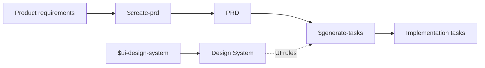

# AI Product Workflow Skills

Three reusable Skills for turning product requirements into a clear PRD, implementation tasks, and UI rules that AI can follow consistently.

I built these Skills to make AI-assisted product work more structured and repeatable. Each Skill has one job, its own supporting rules and templates, and validation where it is useful.

## At a Glance

| Skill | What it does | Output |
| --- | --- | --- |
| [`$create-prd`](./create-prd) | Define what to build before implementation starts | `docs/project/PRD.md` |
| [`$generate-tasks`](./generate-tasks) | Turn an approved PRD into traceable tasks, dependencies, verification steps, and execution prompts | `docs/project/tasks.md` + `docs/project/task-prompt.md` |
| [`$ui-design-system`](./ui-design-system) | Capture project-specific UI rules so future AI changes can reuse existing patterns consistently | `docs/project/design/DESIGN_SYSTEM.md` |

Each Skill keeps a different responsibility clear:

- **PRD** owns product scope and behavior.
- **Design System** owns recurring UI and interaction rules.
- **Tasks** turn approved requirements into executable implementation work.

## How the Skills Work Together

`$create-prd` and `$generate-tasks` work as a sequence: define the product first, then turn the approved PRD into implementation tasks.

`$ui-design-system` is separate. It captures the project's recurring UI rules so future AI changes can reuse existing patterns instead of redesigning each screen. It can be used before UI work, during planning, or later to check for design drift.



## Quick Start

Make the Skill folders available in a Codex-supported Skill location, then call the Skill you need from the project you are working on.

Define or update product requirements:

```text
$create-prd Create or update the PRD from the requirements and current repository.
```

Create or review the project's UI rules:

```text
$ui-design-system Initialize the project's Design System from its current UI patterns and shared components.
```

Turn the approved PRD into implementation work:

```text
$generate-tasks Generate implementation tasks from the current PRD.
```

Codex can discover repository Skills under `.agents/skills` and personal Skills under `$HOME/.agents/skills`.

## Worked Example

The example below shows how the three Skills can work together on one feature.

**Scenario:** add a user credit balance with automatic Stripe recharge when the balance drops below a chosen threshold.

For this example, the Design System Skill is used before task generation because the feature includes new UI. It can also be used independently in other workflows.

### Step 1 — Define the product with `$create-prd`

```text
$create-prd Add user credit balance with automatic Stripe recharge when balance drops below threshold.
```

**What this Skill does here**

It checks the current repository, resolves important product decisions, keeps non-goals explicit, and writes the approved scope to `docs/project/PRD.md` with stable requirement IDs.

**What you get**

- clear goals and non-goals
- stable `FR-*` and `NFR-*` requirement IDs
- explicit product decisions
- a validated PRD ready for planning

<details>
<summary><strong>View example PRD output</strong></summary>

```markdown
# Product Requirements Document: Credit Balance & Auto-Recharge

## Status & Boundaries

- Status: VALIDATED
- Target Path: `docs/project/PRD.md`

## Problem & Goals

- Provide users with uninterrupted access by auto-topping up credits when low.
- Prevent unapproved recurring charges by requiring explicit user opt-in.

## Non-Goals

- Manual bank transfer or invoice payments.
- Real-time balance streaming over WebSocket (dashboard polling is sufficient).

## Functional Requirements

- **FR-01 (Balance Display):** User dashboard shows remaining credits and current recharge threshold.
- **FR-02 (Opt-in Auto-Recharge):** User can enable auto-recharge, choosing threshold (default: 10 credits) and pack size (default: 100 credits for $10).
- **FR-03 (Payment Webhook Trigger):** When balance drops below threshold during an API call, trigger background recharge via Stripe off-session payment.

## Non-Functional Requirements

- **NFR-01 (Idempotency):** Stripe payment intents must pass idempotent request keys derived from user ID and billing epoch.
```

</details>

### Step 2 — Capture UI rules with `$ui-design-system`

```text
$ui-design-system Update the Design System for the credit status badge and auto-recharge settings.
```

**What this Skill does here**

It uses the approved product requirements as context, then updates the project's reusable UI rules without redefining product behavior.

**What you get**

- reusable visual and interaction rules
- shared component patterns
- responsive behavior
- a project-level reference future AI changes can follow

<details>
<summary><strong>View example Design System output</strong></summary>

```markdown
# UI Design System: Billing & Balance Primitives

## Semantic Color Tokens

- `--status-credit-normal`: `hsl(var(--primary))`
- `--status-credit-warning`: `hsl(38 92% 50%)` (Active when balance < threshold)
- `--status-credit-empty`: `hsl(0 84% 60%)` (Active when balance == 0)

## Canonical Component Patterns

### Credit Status Indicator

- Role: Compact dashboard badge displaying current balance and health status.
- Warning State: Uses `--status-credit-warning` background with alert icon; tooltip displays auto-recharge status.
- Class convention: `inline-flex items-center gap-1.5 px-2.5 py-1 rounded-full text-xs font-medium`

### Auto-Recharge Settings Modal

- Role: Financial authorization dialog.
- Rules: Requires explicit checkbox confirmation before enabling; primary CTA must clearly state charge amount (for example, "Save & Authorize $10.00").
- Responsive: Bottom sheet on mobile (< 640px); centered modal with backdrop blur on desktop.
```

</details>

### Step 3 — Plan the implementation with `$generate-tasks`

```text
$generate-tasks Generate implementation tasks for Credit Balance & Auto-Recharge from the validated PRD.
```

**What this Skill does here**

It uses the approved PRD as the source of scope, checks the Design System for relevant UI constraints, and breaks the feature into traceable tasks with dependencies and verification.

**What you get**

- tasks traced back to PRD requirement IDs
- explicit dependencies and execution order
- target files and implementation steps
- verification planned before coding starts
- a separate execution prompt for the coding agent

<details>
<summary><strong>View example task output</strong></summary>

```markdown
# Implementation Tasks: Credit Balance & Auto-Recharge

## Dependency Graph & Execution Order

- Task 1 (Database schema for balance & recharge preferences) [Root]
  ├── Task 2 (Stripe off-session recharge service & webhook handler) [Depends on: Task 1]
  └── Task 3 (Frontend balance badge & recharge settings modal) [Depends on: Task 1]
      └── Task 4 (End-to-end billing integration test) [Depends on: Task 2, Task 3]

## Parent Tasks

### Task 1: Credit Balance Schema & Migrations

- **Stable ID Traceability:** `FR-01`, `FR-02`
- **Target Files:** `src/db/schema/credits.ts`, `drizzle/migrations/0012_credits.sql`
- **Implementation Steps:**
  1. Add `credits_balance` integer column with non-negative check constraint.
  2. Add `auto_recharge_enabled`, `recharge_threshold`, and `recharge_amount` columns.
- **AI Verification:** `pnpm db:check && pnpm test tests/db/credits-schema.test.ts`

### Task 3: Balance Badge & Recharge Modal UI

- **Stable ID Traceability:** `FR-01`, `FR-02`
- **Design System Constraint:** Reuse the existing Credit Status Indicator and Auto-Recharge Settings Modal rules.
- **Target Files:** `src/components/billing/credit-badge.tsx`, `src/components/billing/recharge-modal.tsx`
- **AI Verification:** `pnpm typecheck && pnpm lint:check`
```

</details>

## Design Principles

- Define product scope before planning implementation.
- Keep current work separate from existing behavior and future ideas.
- Trace implementation tasks back to PRD requirements.
- Check the current repository instead of guessing how the project works.
- Plan verification before implementation starts.
- Do not add infrastructure or product scope just because a project template supports it.
- Keep product behavior in the PRD and recurring UI rules in the Design System.

## Repository Structure

```text
.
├── create-prd/
│   ├── SKILL.md
│   ├── agents/
│   ├── assets/
│   ├── references/
│   └── scripts/
├── generate-tasks/
│   ├── SKILL.md
│   ├── agents/
│   ├── assets/
│   ├── references/
│   ├── scripts/
│   └── tests/
├── ui-design-system/
│   ├── SKILL.md
│   ├── agents/
│   ├── assets/
│   ├── references/
│   └── scripts/
├── AGENTS.md
├── LICENSE
└── README.md
```

Each Skill uses the same basic structure. `SKILL.md` contains the main workflow, with supporting templates, references, validators, tests, and agent metadata where needed.

## Installation

Use the Skill folders in a Codex-supported location:

- **Project-specific:** `.agents/skills`
- **Personal:** `$HOME/.agents/skills`

You can use one Skill on its own or keep all three available in the same project.

See the [official OpenAI Skill documentation](https://developers.openai.com/codex/skills) for current installation and discovery options.

## License

This project is licensed under the Apache License 2.0. See [LICENSE](./LICENSE) for details.
